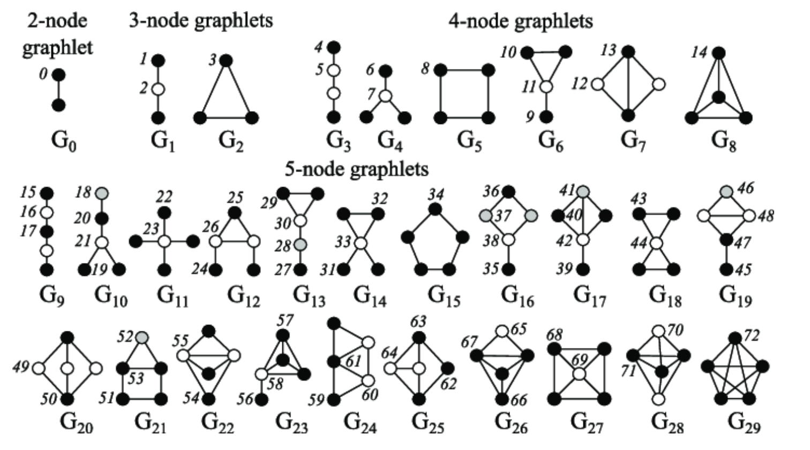

# CS224W：图机器学习导论

### 图机器学习研究的问题

- 相比于图像和文本，图结构的大小比较随意，没有固定的节点顺序，并且通常是动态的
- 图学习的任务可以有node level，edge level，community level和graph-level多个层次，常见的有
  - 节点分类：比如预测线上用户的类型
  - 链接预测：预测两个节点之间是否缺少了链接，比如知识图谱补全
  - 图分类：比如化学中的分子性质预测
  - 聚类：检测节点是否构成一个类别，比如社交圈检测
  - 其他的还有图生成，图进化等等

### 图的表示方式

- 常见的表示方式使用节点集合N和边集合E构成一个图结构$G(N, E)$ 
  - 二部图是一种特殊的图结构，可以将图中的**节点**分成两个不相交的集合U和V，使得图中的任意一条边的两个顶点分别属于U和V，可以将其进行分解
  
    
  
- 图也可以用**接邻矩阵**来表示，其中无向图的邻接矩阵是一个对称矩阵，通常邻接矩阵都比较稀疏

- 图可以用接邻表来表示，这种表示方式只保留了有边的节点的情况，而舍去了稀疏的大部分内容，节约了存储空间

- 边可以有多种属性，比如权重，ranking,type,sign,等等

- 一些图中的基本概念：
  - 强连通有向图：任意两个节点U和V之间存在U到V以及V到U的路径
  - 弱连通有向图：任意两个节点U和V之间存在U到V或者V到U的路径
  - 强连通分量：有向图中的强连通子图
  
- 图的表示：

  

- 图的不同层级

## 传统的图机器学习方法

- 传统的机器学习通过手工提取特征来完成图机器学习中的node-level，link-level和graph-level的一些预测，目标是对于给定的图$G=(V, E)$学习出一个从V映射到R上面的函数 $f:V\to \R$

### 节点层面的机器学习任务 node-level

- 图机器学习在节点层面的主要任务是对**节点进行分类**和学习**图的结构特征**，主要有：
  - 节点的度数n     无法区别相同度但是不同部位得节点得区别
  - 节点的中心(node centrality)   主要考虑节点位置
  - 聚类系数  接触的三角形数量
  - GDV节点参与的图元数量

#### node centrality 节点中心性

#####         Eigenvector centrality特征向量中心

​		节点中心node centrality是在在一个图中表示出不同节点的**重要性**，而不是简单的出入度数。一个节点v如果与一些很重要的节点相邻那么这个节点也很重要，一个节点的centrality可以这样计算：
$$
c_v=\frac{1}{\lambda}\sum_{u\in N(v)}c_u
$$

- 问题在于上面的这个表达式其实是一种循环定义，需要用另一种方法来表示

- 特征向量中心：我们可以用向量的相识来表示上面的centrality定义式：
  $$
  \lambda c=Ac
  $$

  - 其中A是图G的邻接矩阵 
  
  - 我们发现这时候由每个点的centrality组成的向量C实际上就是矩阵A的特征向量，其中最大的特征向量总是为正并且唯一的，因此可以用A矩阵的最大特征值作为图G的centrality（根据Perron-Frobenius定理)
  
    ##### 中间性中心Betweenness Centrality
  
  - 该标准认为一个节点如果处于很多通往其他节点的最短路径上，那么这个节点就比较重要，因此定义：
  
  $$
  c_v=\sum_{s\not=t\not=v}\frac{N_{svt}}{N_{sv}}
  $$
  
  - 该标准下重要程度的计算方式就是对于图中的任意两个和v不同的节点s，t，计算其最短路径中包含v的比例并进行求和
  
  ##### 邻近中心Closeness Centrality
  
  - 该标准认为一个节点如果拥有比较小的**到其他所有节点**的最短路径长度，那么它就比较重要，用l表示图中两个节点的最短路径长，那么：
  
  $$
  c_v=\frac 1 {\sum_{u\not=v}l_{uv}}
  $$

#### 聚类系数 clustering cofficient

​		聚类系数可以衡量一个节点的邻居节点的连接情况，假设一个节点v有k个邻居，这些**k个邻居之间有n条边**，那么聚类系数可以写作：
$$
e_v=\frac{n}{C_k^2}=\frac{2n}{k(k-1)}
$$

现有得变数除以最大可能的边数

聚类系数某种意义上也可以理解为记录了每个节点与其邻近节点**构成的三角形的个数**，即对于一个节点v，如果它的两个邻居u和w之间有一条边，那么uvw就构成了一个三角形，而这个三角形被统计到了聚类系数中去（你的朋友之间是否相互认识，聚类系数在社交网络上十分重要）

#### Graphlets 图元

​		Graphlets是一种根连通的非同构子图，下图中黑色的点表示等价

- Graphlet Degree Vector(GDV)：基于Graphlets的节点特征，记录了每个节点所能接触到的graphlets的个数，和度数以及聚类系数不同，度数衡量了一个节点能接触到的边的数量，而聚类系数衡量了一个节点能接触到的“三角形”的个数，而GDV记录了以一个节点v为root的所有的graphlet

- GDV提供了一个节点的局部网络拓扑结构的衡量方式

### 边层面  link-level

   主要任务是基于已经存在的连接来**预测新的连接**，因此关键的问题在于如何设计和表示**一对节点**的特征，一般有两种边预测的场景：

- 随机缺失了若干条边，要求将图补全

- 随时间会变化的边关系：在时许数据的场景下节点和节点之间的边关系可能会随时间发生变化，这种情况叫做evaluation，一般来说可以用如下步骤来解决时序预测问题：
  - 对每一个节点对计算一个score C，即一个既定的标准（可以是x和y之间的共同邻居数量
  - 根据这个标准来对节点对进行排序
  - 预测排序中的top-n作为新的边，并进行验证,检测效果
  
  

一下目标描述节点之间的关系，以此为基础来预测边的存在

#### 基于距离的特征 distance-based feature

- 用两个节点之间的最短路径距离来表示节点对的特征，但是这种方式没有考虑到邻近点的重合度

#### Local Neighborhood Overlap

​		用共同的邻近节点的个数作为一个节点对的特征，对于一个节点v，用$N(v)$表示所有邻近节点构成的集合，那么有这样几种标准。如果没有邻居，则值为0，但是未来可能会被连接，未来解决这个问题，提出global neighborhood overlap

- 共同邻居：

$$
｜N(u)\cap N(v)|
$$

- Jaccard系数

$$
\frac{｜N(u)\cap N(v)|}{｜N(u)\cup N(v)|}
$$

- Adamic-Adar index

$$
\sum\limits_{u\in N({{v}_{1}})\cap N({{v}_{2}})}^{{}}{\frac{1}{\log ({{k}_{u}})}}
$$

#### Global Neighborhood Overlap

- Katz index：
- 记录两个节点之间所有的路径数，可以使用邻接矩阵来计算，假设临界矩阵为A，其中如果u和v相邻那么$A_{uv}=1$，这样一来$A_{uv}^{k}$就可以表示是否有连接u,v的长度为k的路径(可以用矩阵运算来证明，$A_{uv}^{k}$表示$A$的k次，角标为$uv$），因此可以用下面的共识来计算这一特征量($0<\beta<1$, discount factor：

$$
S_{uv}=\sum_{l=1}^{\infin}\beta ^lA_{uv}^l
$$

- 而Katz index矩阵可以用如下方式来计算：

$$
(I-\beta A)^{-1}=\sum_{i=0}^{\infin}\beta^iA^i\\
S=\sum_{i=1}^{\infin}\beta^iA^i=(I-\beta A)^{-1}-I
$$

### 图层面的特征和图kernel   graph-level

​		目标是提取整张图整体的特征，而传统机器学习中经常使用kernel来进行特征的提取，图也可以使用kernel来进行特征的提取，其核心是一个图特征向量$\phi(G)$ 

#### BoW

​		图kernel的关键想法是**基于Bag-of-Word(BoW)**BoW原本是指使用单词出现的次数来作为文档的特征，而将其扩展到图上就可以将节点作为“单词”，即可以计算**图中各种不同度数的节点的数量**，并将结果作为一个多维的向量输出，向量的每一个维度d的值代表了图中度数为d的节点总数

#### Graphlet特征

- 可以计算图中不同的graphlet的个数来表示图的特征，但是这里的graphlet和节点层面的不太一样，不需要完全连接，也没有根的概念

- 对于一个给定的图G，用一个graphlet表来定义graphlet计数向量$f_G\in\mathbb R^{n_k}$ ，则：

$$
(f_G)_i=\#(g_i\subset G)
$$

- graphlet kernel可以定义为：

$$
K(G,G')=f_G^Tf_{G'}
$$

- 如果两张图的size不同会引起结果的失真，那么就可以进行正则化操作，令：

$$
h_G=\frac{f_g}{\sum f_G}\rightarrow K(G,G')=h_G^Th_{G'}
$$

- 这种kernel的问题在于计算graphlet的个数的时间复杂度是非常高的（k个图元，n个节点，$n^k$），并且是NP-hard的

#### Weisfeiler-Lehman Kernel    /  color refinement

起始颜色$c^{(0}(v)$

迭代（收集临近色，再hash映射）
$$
c^{(k+1)}(v)=hash( {c^{(k)}(v)},(c^{(k)}(u))_{u \in N(v)})
$$
计算更为高效，呈线性关系

